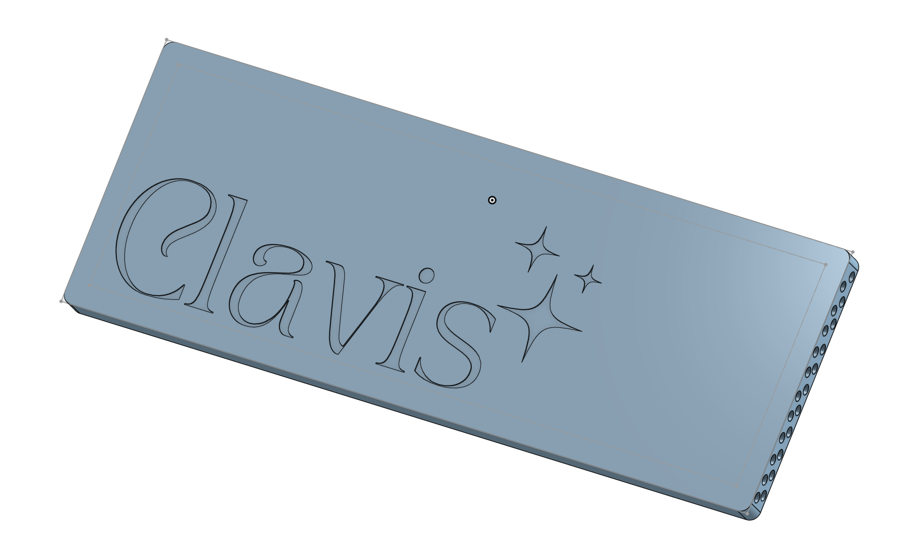
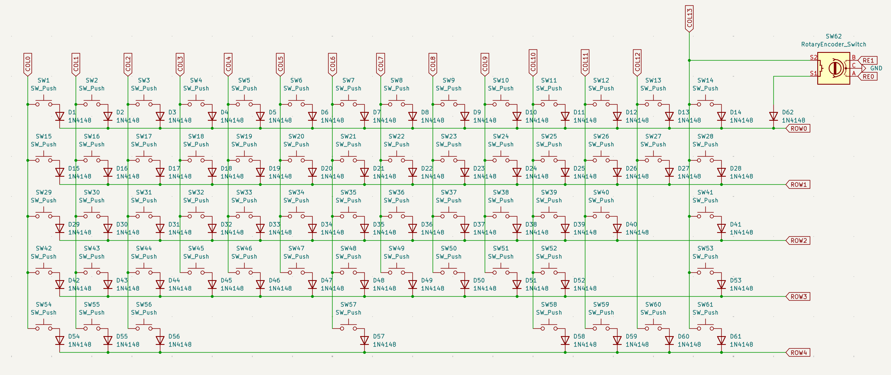
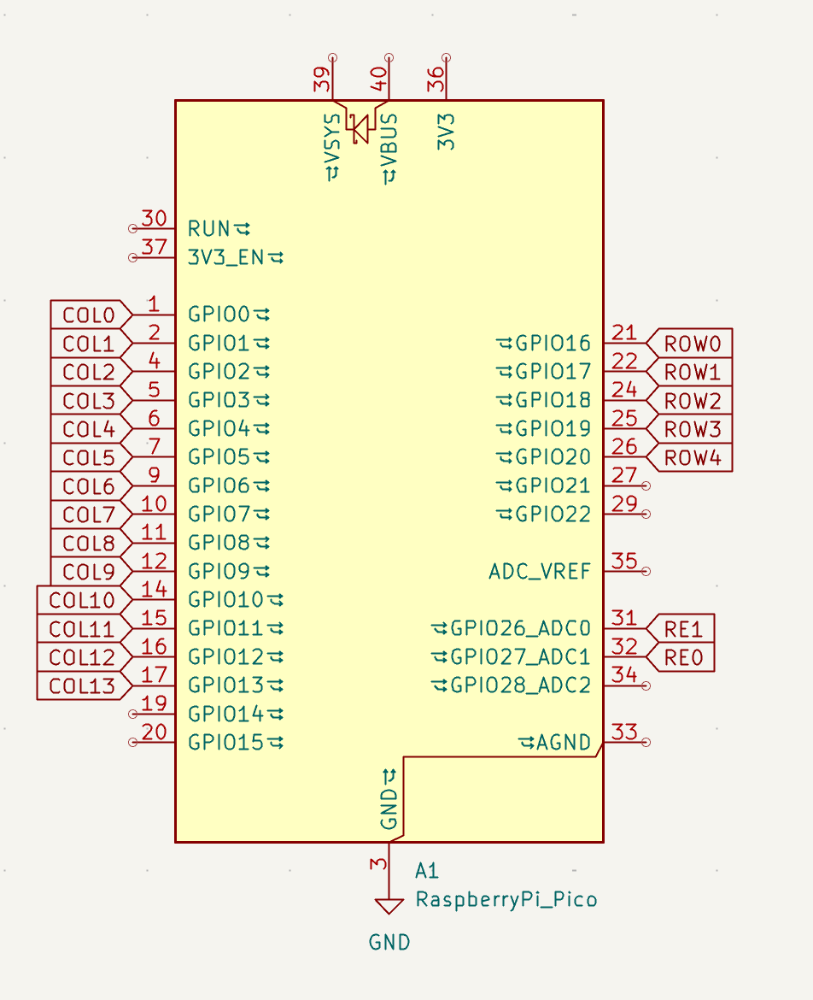
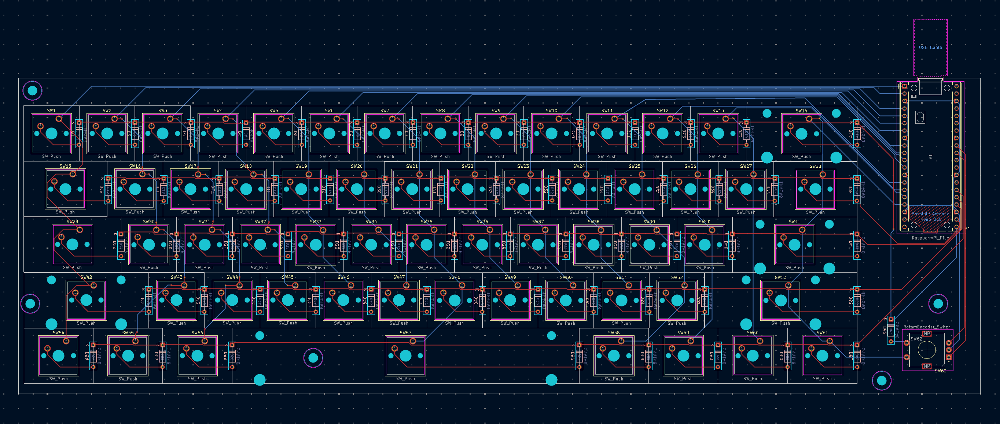
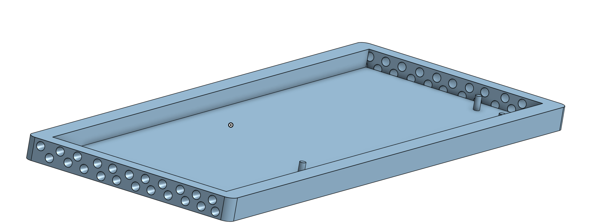
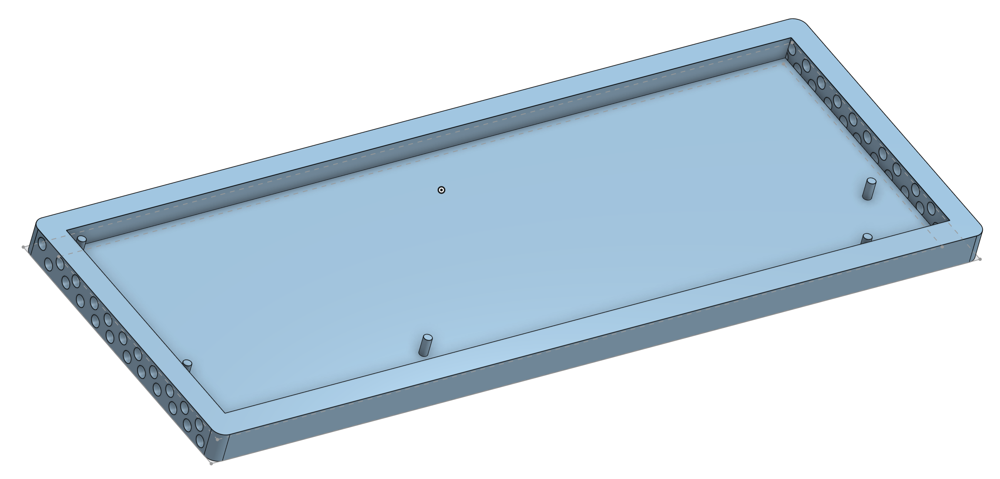
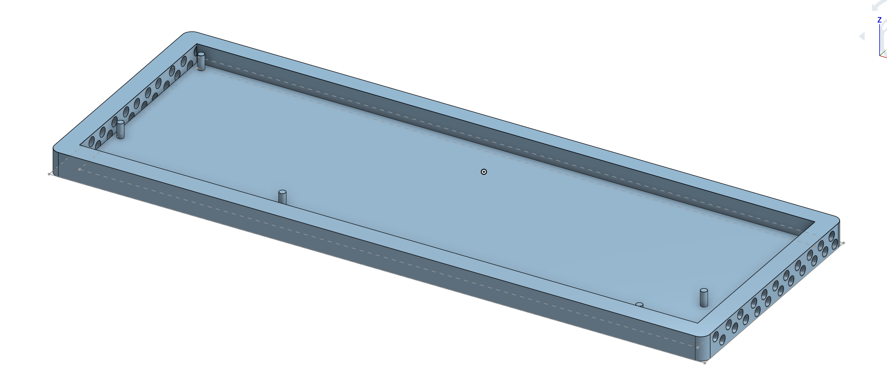

# Clavis

### Why did I make it?
I have always did software, and I wanted to dip my hands in hardware, so my first project was actually a USB Hub, but I was too lazy to submit that project and ofcourse too lazy to do this also, but I need a keyboard badly, so I made it instead of spending money to buy one.

### What was the hardest part about this ?
First time trying hardware and its actually interesting, I lowkey ditched software so hard, I haven't touched anything for the past week or so.
Really fun doing hardware not gonna lie!

Features:

- RotaryEncoder for Volume Control
- 61 keys
- Raspberry Pi Pico
- Customised layout
- KMK firmware
- Clavis Branded PCB
- Custom case

### Schematic

### PCB 

### Case

- Side

I made some aesthetic for Clavis. Like I have added holes on all the sides to make it look more good

### 3D view of all parts 

link to full 3d thing-
https://cad.onshape.com/documents/d7d12a2fa7bc04b5800dbd2d/w/ac455ce448d0103039519ee4/e/ea51435a206a6c9dcede9359?renderMode=0&uiState=69c59b2f46e4975077a9ca15

A special thanks to Anay and Aditya who are helping me to make my projects better. Love them so much!

## BOM
| Name                                                          | Purpose                          | Quantity | Cost (INR) | Cost (USD) | Link                                                                              | Distributer |
|---------------------------------------------------------------|----------------------------------|----------|------------|------------|-----------------------------------------------------------------------------------|-------------|
| Akko Mirror Switch                                            | Switches for the keyboard        | 61       | ₹1,998     | $21.24     | https://stackskb.com/store/akko-mirror-switch-pack-of-45-pre-order/               | StacksKB    |
| Veekos Gradient Keycaps (Cherry Profile) (135 keys) (Blue)    | Keycaps for the keyboard         | 1        | ₹1,299     | $13.90     | https://stackskb.com/store/veekos-gradient-keycaps-cherry-profile-135-keys/       | StacksKB    |
| Durock Smokey Screw-In Stabilizers V2 (4+1 w/ 6.25u spacebar) | Stabilizers for longer keys      | 1        | ₹1,595     | $17.00     | https://stackskb.com/store/durock-smokey-screw-in-stabilizers-v2/                 | StacksKB    |
| EC11 Rotary Encoder with Switch                               | RotaryEncoder for Volume Control | 1        | ₹64        | $0.68      | https://www.flyrobo.in/15mm-ec11-rotary-encoder-with-switch-digital-potentiometer |             |
| Diode 1N4148 Through - Hole                                   | Diode for every switch           | 1        | ₹99        | $1.08      | https://www.amazon.in/dp/B084ZP5BJ3?_encoding=UTF8&psc=1                          |             |
| Raspberry Pi Pico                                             | Rasp Pi Pico as the MCU          | 1        | ₹599       | $6.40      | https://www.amazon.in/Raspberry-Pi-Headers-Soldered-Micro/dp/B08WPNM7JB           |             |
| PCB                                                           | Main PCB of the keyboard         | 5        | ₹2,584     | $27.47     | https://jlcpcb.com/                                                               |             |
| M3 x 8mm Bolt                                                 | Screws                           | 10       | ₹163       | $1.73      | https://www.amazon.in/dp/B07X8PHXKB                                               |             |
| M3 Nuts                                                       | Screws                           | 12       | ₹74        | $0.79      | https://www.amazon.in/dp/B09J92WY5Q                                               |             |
| M3 x 5mm Heatset Insert                                       | Screws                           | 25       | ₹196       | $2.09      | https://www.amazon.in/dp/B0CX1BS7DJ                                               |             |
| Soldering Iron Kit                                            | Soldering Iron Kit               | 1        | ₹495       | $5.26      | https://www.amazon.in/dp/B0FC2YM1RY                                               |             |
| Case                                                          | Case for the keyboard            | 1        | ₹0.00      | $0.00      | Printing Legion                                                                   |             |
|                                                               |                                  |          |            |            |                                                                                   |             |
|                                                               |                                  |          | ₹9,166     | 97.64      |                                                                                   |             |

## Total Pricing
The total price comes out to be 9,166 INR ($97.64)

The pricing might slightly vary due to flash sales, and dollar market trends.